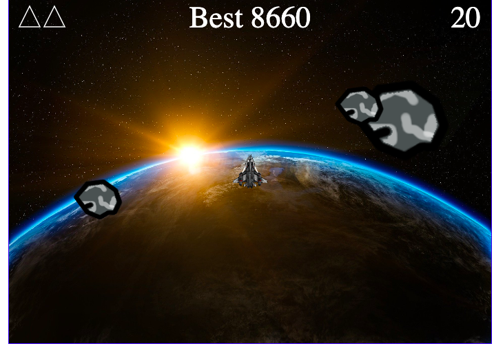

# Meteoriod Destroyer

Our love of playing classic games was brought to reality by being able to actually re-create one of the classics using JavaScript and HTML5 Canvas. We recreated the classic game Asteroids with some newly added features like a high score for anyone who can top that score and newly added visuals.

## Getting Started

Steps:

1. In your terminal run `bundle install` to install gems.
2. Navigate to `index.html` and open that in your browser to start playing the game. 
3. Enjoy and have a blast.

## Controls

* `arrow key up`  - to thrust up and move forward.
* `arrow key right` - to slow down and turn ship to right 
* `arrow key left` - to slow down and turn ship
* `space bar` - shoots laser

## Features

* User can control the ship through keyboard strokes or login and view their profile page
* User can attempt to get the highest score of all participants
* User can enjoy playing a game to take a load off :)

## Made Using:

* HTML5 Canvas
* Ruby on Rails API
* JavaScript DOM manipulation with querySelectors
* Styling with BootStrap CSS

## Authors

* **Andy Reyes** - [AndyRey7](https://github.com/AndyRey7)
* **Elliot Chen** -  [lltchen](https://github.com/lltchen)
